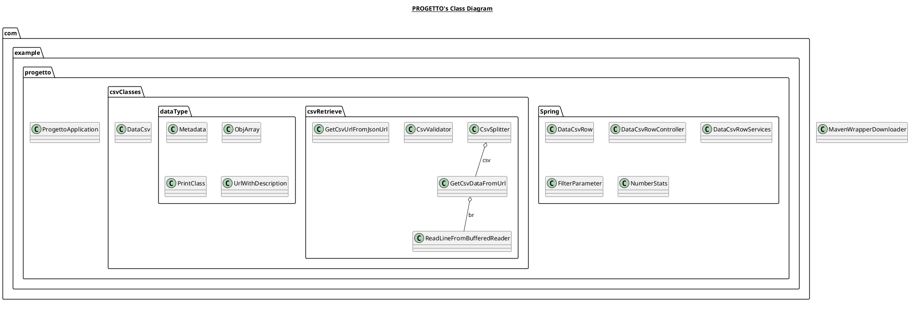

progetto-programmazione-ad-oggetti-java
=======================================
The purpose of this project is to read and analyze a data-set and to create a set of classes to represent it.

Our data-set is a Examples of EU funded projects. Our Java projects consist in this features:

###### At the start of the program:

Our program download in ram the data-set of the CSV from the Json URL. This first operation is performed when the application is started.  This is done by the class GetCsvUrlFromJsonUrl. This class read the json from the URL and get the URL of the CSV. After that the main call another class to read the data of the csv and save them in a class.

###### When the reading is completed:

The data are split and parse in a data structure based on the above classes, because every record of the data-set correspond to an object of a class. The data structure are two; one for the data and one for the *Metadata*. Every row of the data-set represent an *Eu founded project* and each field of the columns is the *Metadata.* Every *Eu founded project* have this fields:

- nid...

We had some cases where some fields of the row had some HTML tag and some end of line character in the quotation marks. In the first case we resolved the problem creating a method that delete only the tag conserving the URL and the anchor of the link:

```java
public static ObjArray<UrlWithDescription> validateUrlArraySemicolonSeparated(String s)
{
    String[] tmp = s.split(";");

    UrlWithDescription[] urls = new UrlWithDescription[tmp.length];

    for (int i = 0; i < tmp.length; i++)
    {
        urls[i] = new UrlWithDescription();
        urls[i].setDescription(validateString(tmp[i]));
        try
        {
            urls[i].setUrl(tmp[i].replace("\"<a href=\"", "").replace("<a href=\"",                   "").split("\"")[1]);
        }
        catch (Exception e)
        {
            urls[i].setUrl("NULL");
        }
    }
    return new ObjArray<>(urls);
}
```

For the second problem we had to create a new class that simulate the read line of the Buffered Reader, this class read the line character by character,and where the reader find a end of line character it doesn't add it at the string.

###### On Postman:

Using API Rest GET and POST we return data, metadata, statistics and filtered datasets. 

Afterwards the various requests that can be carried out with relevant examples will be listed.

------

#### GET Request:

##### /data

Return all the data-set.

##### /data/{colName}?excludeNull={true | false}

Return the data only of the specified column; and if the parameter excludeNull is true all the null values of the column are excluded, otherwise all the data are retrieved.

```html 
localhost:8080/data/nid?excludeNull=false
```


##### /metadata

Return all the field with the alias, the source field and the type of every field.

##### /stats/{colName}

Return the statistics only based on the *NumberStats* class. The only two statistics that have some sense are:

- euBudgetContribution 
- totalProjectBudget

The statistics that result from the class are:

- Average
- Minimum
- Maximum
- Standard Deviation
- Sum

And are calculated in this method:

```java
for (DataCsvRow item : csvData)
{
    Method m = item.getCl
        ass().getMethod("get" + fieldName);
    int data = (int) m.invoke(item);
    min = (min == null ? data : (min < data ? min : data));
    max = (max == null ? data : (max > data ? max : data));
    sum += data;
    tmp[i++] = data;
}
avg = sum / count;
for (int xi : tmp)
{
    std += Math.pow(xi - avg, 2);
}
std = Math.sqrt(std / count);
```

*example:*

```html 
localhost:8080/stats/totalProjectBudget
```

*response:* 

```json
{
    "avg": 20234875,
    "min": 0,
    "max": 2110874201,
    "std": 99926570.48545268,
    "sum": 35249152826
}
```


##### /search?value="value"&exactMatch={"true" | "false"}

Return only the row where the value is contained into it; if the parameter exactMatch is true only the row where an element as the exact match of the value are returned, otherwise the row that contain into them the value are returned.

```haml
localhost:8080/filter
```

~~~~~~~~~~~~~~~~~~~~~~~~~~~~~~~~~~~~~~~~~~~~~~~~~~~~~~~~~~~~~~~~~~~~~~~~~~~~~~~~json
{
    "$or": [
        {
            "fieldName": "projectAcronym",
            "operator": "==",
            "value": "SONO"
        },
        {
            "fieldName": "name",
            "operator": "==",
            "value": "The INOV Contacto Programme"
        }
    ]
}
~~~~~~~~~~~~~~~~~~~~~~~~~~~~~~~~~~~~~~~~~~~~~~~~~~~~~~~~~~~~~~~~~~~~~~~~~~~~~~~~


````html 
localhost:8080/filter
````

```json
{
    "$and": [
        {
            "fieldName": "nid",
            "operator": ">=",
            "value": "100"
        },
        {
            "fieldName": "totalProjectBudget",
            "operator": "<",
            "value": "5000"
        },
        {
            "fieldName": "totalProjectBudget",
            "operator": ">",
            "value": "100"
        }
    ]
}
```



